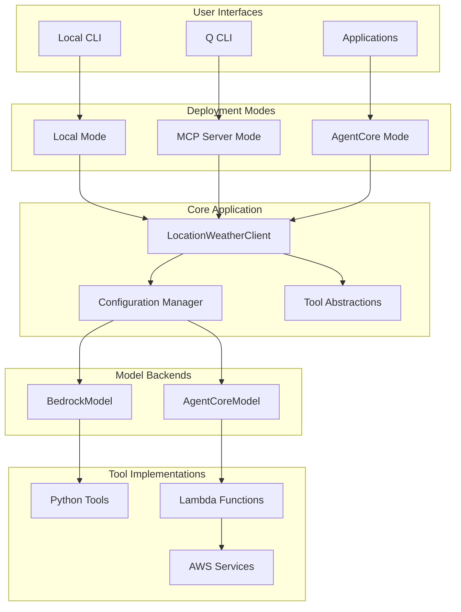
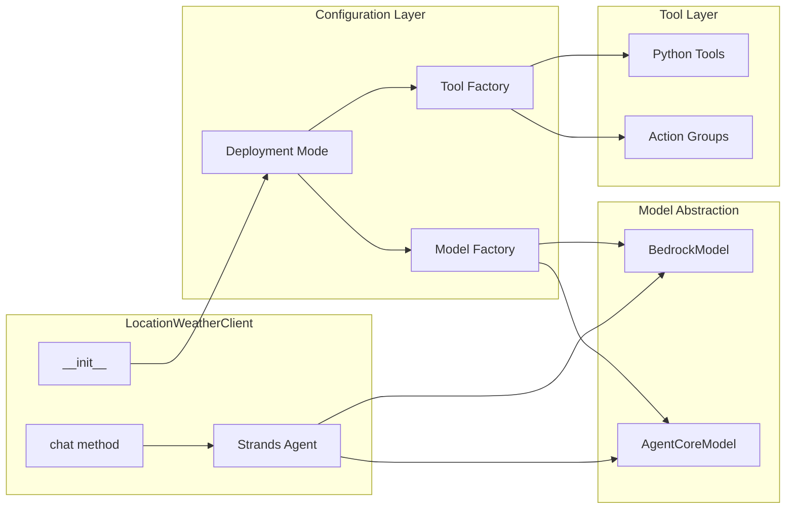

# AgentCore Migration Design

## Overview

This design document outlines the architecture for migrating the Strands-based location-weather service to support AWS Bedrock AgentCore while maintaining backward compatibility. The solution implements a unified codebase with configuration-driven deployment modes, enabling seamless operation across local development, Q CLI MCP server, and AgentCore production environments.

## Architecture

### High-Level Architecture



### Component Architecture



## Components and Interfaces

### 1. Configuration Manager

**Purpose**: Centralized configuration management for deployment mode selection and environment-specific settings.

**Interface**:
```python
@dataclass
class DeploymentConfig:
    mode: DeploymentMode  # LOCAL, MCP, AGENTCORE
    bedrock_model_id: str
    agentcore_agent_id: Optional[str]
    aws_region: str
    enable_tracing: bool

class ConfigurationManager:
    def get_deployment_config() -> DeploymentConfig
    def get_model_config() -> ModelConfig
    def get_tool_config() -> ToolConfig
```

**Key Responsibilities**:
- Environment variable processing
- Configuration validation
- Mode-specific parameter resolution
- Default value management

### 2. Model Factory with Strands Integration

**Purpose**: Abstract model creation based on deployment mode, leveraging Strands' native AgentCore support.

**Interface**:
```python
from strands.models import BedrockModel, AgentCoreModel

class ModelFactory:
    @staticmethod
    def create_model(config: DeploymentConfig) -> Union[BedrockModel, AgentCoreModel]:
        """Create appropriate Strands model based on deployment mode"""
        if config.mode == DeploymentMode.AGENTCORE:
            return AgentCoreModel(
                agent_id=config.agentcore_agent_id,
                region_name=config.aws_region,
                # Strands handles AgentCore protocol automatically
            )
        else:
            return BedrockModel(
                model_id=config.bedrock_model_id,
                region_name=config.aws_region
            )
    
    @staticmethod
    def validate_model_config(config: DeploymentConfig) -> bool
```

**Strands-Specific Features**:
- **Native AgentCore Support**: Strands `AgentCoreModel` handles protocol translation
- **Automatic Tool Registration**: Strands manages action group registration
- **Unified Interface**: Same `Agent` class works with both model types
- **Built-in Error Handling**: Strands provides consistent error handling across models

### 3. Strands Tool Integration Strategy

**Purpose**: Leverage Strands' native tool system for seamless AgentCore integration.

**Strands Tool Approach**:
```python
from strands import tool

# Tools defined once, work across all deployment modes
@tool
def get_weather(latitude: float, longitude: float) -> dict[str, Any]:
    """Get weather information - works in local, MCP, and AgentCore modes"""
    # Same implementation as current
    pass

@tool  
def get_alerts(latitude: float, longitude: float) -> list[dict[str, Any]]:
    """Get weather alerts - works in local, MCP, and AgentCore modes"""
    # Same implementation as current
    pass

class ToolManager:
    def get_tools_for_mode(self, mode: DeploymentMode) -> List[Tool]:
        """Return appropriate tools based on deployment mode"""
        base_tools = [get_weather, get_alerts, current_time]
        
        if mode == DeploymentMode.AGENTCORE:
            # For AgentCore, tools are registered as action groups
            # Strands handles the Lambda deployment automatically
            return base_tools
        else:
            # For local/MCP modes, include MCP tools
            return base_tools + self.mcp_tools
```

**Strands Tool Benefits**:
- **Single Definition**: Tools defined once with `@tool` decorator work everywhere
- **Automatic Lambda Generation**: Strands can generate Lambda functions from tools
- **Schema Generation**: Strands automatically generates OpenAPI schemas
- **Protocol Translation**: Strands handles AgentCore event/response format
- **Error Handling**: Consistent error handling across deployment modes

### 4. Enhanced LocationWeatherClient with Strands Integration

**Purpose**: Main client class leveraging Strands' unified Agent interface for seamless multi-mode support.

**Interface**:
```python
from strands import Agent
from strands.models import BedrockModel, AgentCoreModel

class LocationWeatherClient:
    def __init__(
        self,
        deployment_mode: Optional[DeploymentMode] = None,
        custom_system_prompt: Optional[str] = None,
        config_override: Optional[Dict] = None
    ):
        config = self._resolve_config(deployment_mode, config_override)
        model = ModelFactory.create_model(config)
        
        # Strands Agent works identically with both model types
        self.agent = Agent(
            model=model,
            tools=self._get_tools_for_mode(config.mode),
            system_prompt=custom_system_prompt or self._get_system_prompt()
        )
    
    def chat(self, prompt: str) -> str:
        """Unified interface - Strands handles protocol differences"""
        return self.agent(prompt)
    
    def get_deployment_info(self) -> DeploymentInfo
    def health_check(self) -> HealthStatus
```

**Strands-Specific Advantages**:
- **Unified Agent Interface**: Same `Agent` class for all deployment modes
- **Automatic Protocol Handling**: Strands manages BedrockModel vs AgentCoreModel differences
- **Tool Registration**: Strands handles tool registration for AgentCore action groups
- **Consistent Error Handling**: Unified error handling across deployment modes
- **Built-in Observability**: Strands provides consistent metrics and tracing

### 5. AgentCore Integration Components

**Purpose**: Components specific to AgentCore deployment mode following the runtime service contract.

**Lambda Function Template** (AgentCore Contract Compliant):
```python
def lambda_handler(event, context):
    """
    AgentCore Lambda handler following runtime service contract
    Input: event['requestBody']['content'][0]['text'] contains function parameters
    Output: Must return {'response': {'body': result_data}}
    """
    try:
        # Extract parameters from AgentCore event structure
        request_body = event.get('requestBody', {})
        content = request_body.get('content', [{}])
        parameters = json.loads(content[0].get('text', '{}'))
        
        # Execute business logic
        result = execute_tool_logic(parameters)
        
        # Return in AgentCore expected format
        return {
            'response': {
                'body': json.dumps(result)
            }
        }
    except Exception as e:
        return {
            'response': {
                'body': json.dumps({'error': str(e)})
            }
        }
```

**Action Group Definitions** (OpenAPI Schema Required):
```python
weather_action_group_schema = {
    "openapi": "3.0.0",
    "info": {"title": "Weather Services", "version": "1.0.0"},
    "paths": {
        "/get_weather": {
            "post": {
                "description": "Get weather information for coordinates",
                "requestBody": {
                    "required": True,
                    "content": {
                        "application/json": {
                            "schema": {
                                "type": "object",
                                "properties": {
                                    "latitude": {"type": "number"},
                                    "longitude": {"type": "number"}
                                },
                                "required": ["latitude", "longitude"]
                            }
                        }
                    }
                },
                "responses": {
                    "200": {
                        "description": "Weather data",
                        "content": {
                            "application/json": {
                                "schema": {
                                    "type": "object",
                                    "properties": {
                                        "temperature": {"type": "object"},
                                        "windSpeed": {"type": "object"},
                                        "shortForecast": {"type": "string"}
                                    }
                                }
                            }
                        }
                    }
                }
            }
        }
    }
}
```

**AgentCore Service Contract Requirements**:
- Lambda functions must handle AgentCore-specific event structure
- Response format must match `{'response': {'body': json_string}}`
- OpenAPI 3.0 schemas required for all action groups
- Error responses must follow consistent format
- Function names must match OpenAPI path operations

## Data Models

### Configuration Schema

```python
class DeploymentMode(Enum):
    LOCAL = "local"
    MCP = "mcp"
    AGENTCORE = "agentcore"

@dataclass
class ModelConfig:
    model_type: str
    model_id: Optional[str]
    agent_id: Optional[str]
    region: str
    timeout: int

@dataclass
class ToolConfig:
    weather_api_config: WeatherAPIConfig
    location_service_config: LocationServiceConfig
    lambda_config: Optional[LambdaConfig]
```

### Tool Interface Schema

```python
@dataclass
class ToolDefinition:
    name: str
    description: str
    parameters: Dict[str, Any]
    return_schema: Dict[str, Any]
    implementation: Union[Callable, str]  # Function or Lambda ARN

@dataclass
class ToolResult:
    success: bool
    data: Optional[Dict[str, Any]]
    error: Optional[str]
    execution_time: float
```

### AgentCore Specific Models

```python
@dataclass
class ActionGroupConfig:
    name: str
    description: str
    lambda_functions: List[str]
    openapi_schema: Dict[str, Any]  # Must be OpenAPI 3.0 compliant
    execution_role_arn: str  # Required for Lambda invocation

@dataclass
class AgentConfig:
    agent_id: str
    agent_name: str
    instructions: str  # System prompt equivalent
    action_groups: List[ActionGroupConfig]
    foundation_model: str  # Must be supported by AgentCore
    idle_session_ttl: Optional[int] = 3600  # Session timeout
    
@dataclass
class AgentCoreEvent:
    """Structure of events received by Lambda from AgentCore"""
    request_body: Dict[str, Any]
    agent: Dict[str, str]
    action_group: Dict[str, str]
    function: Dict[str, str]
    
@dataclass
class AgentCoreResponse:
    """Required response format for AgentCore Lambda functions"""
    response: Dict[str, str]  # Must contain 'body' key with JSON string
```

## Error Handling

### Error Classification

**Configuration Errors**:
- Invalid deployment mode
- Missing required parameters
- Authentication failures

**Runtime Errors**:
- Model invocation failures
- Tool execution errors
- Network connectivity issues

**Protocol Errors**:
- MCP communication failures
- Lambda invocation errors
- HTTP timeout errors

### Error Handling Strategy

```python
class LocationWeatherError(Exception):
    """Base exception for location weather service"""
    pass

class ConfigurationError(LocationWeatherError):
    """Configuration-related errors"""
    pass

class ModelError(LocationWeatherError):
    """Model invocation errors"""
    pass

class ToolError(LocationWeatherError):
    """Tool execution errors"""
    pass

class ErrorHandler:
    def handle_error(self, error: Exception, context: Dict) -> ErrorResponse
    def should_retry(self, error: Exception) -> bool
    def get_fallback_response(self, error: Exception) -> str
```

### Graceful Degradation

1. **Model Fallback**: If AgentCore fails, fallback to direct Bedrock
2. **Tool Fallback**: If Lambda tools fail, use local implementations
3. **Partial Functionality**: Continue with available tools if some fail
4. **User Communication**: Clear error messages with suggested actions

## Testing Strategy

### Unit Testing

**Configuration Testing**:
- Mode selection validation
- Parameter resolution
- Environment variable handling

**Model Factory Testing**:
- Model creation for each mode
- Configuration validation
- Error handling

**Tool Testing**:
- Individual tool functionality
- Protocol adaptation
- Error scenarios

### Integration Testing

**Mode-Specific Testing**:
- Local mode end-to-end
- MCP server functionality
- AgentCore integration

**Cross-Mode Testing**:
- Configuration switching
- Response consistency
- Performance comparison

### Testing Infrastructure

```python
class TestEnvironment:
    def setup_local_mode(self) -> LocationWeatherClient
    def setup_mcp_mode(self) -> LocationWeatherClient
    def setup_agentcore_mode(self) -> LocationWeatherClient
    def compare_responses(self, clients: List[LocationWeatherClient], prompt: str)

class MockServices:
    def mock_bedrock_model(self) -> Mock
    def mock_agentcore_agent(self) -> Mock
    def mock_lambda_functions(self) -> Mock

class SecurityTestSuite:
    """Security testing following AgentCore samples patterns"""
    def test_prompt_injection_protection(self):
        """Test guardrails against prompt injection attempts"""
        pass
        
    def test_pii_detection(self):
        """Test PII detection and anonymization"""
        pass
        
    def test_content_filtering(self):
        """Test inappropriate content filtering"""
        pass
        
    def test_input_validation(self):
        """Test input sanitization across all modes"""
        pass

class ExperimentalPatternTests:
    """Additional testing for experimental AgentCore patterns"""
    def test_error_boundary_conditions(self):
        """Test edge cases not covered in AWS samples"""
        pass
        
    def test_production_readiness(self):
        """Validate production-ready vs experimental components"""
        pass
```

## Performance Considerations

### Latency Optimization

**Local Mode**: Direct function calls (~10ms overhead)
**MCP Mode**: Protocol overhead (~50-100ms)
**AgentCore Mode**: Lambda cold start + network (~200-500ms first call, ~50-100ms warm)

### Caching Strategy

```python
class CacheManager:
    def cache_model_responses(self, key: str, response: str, ttl: int)
    def cache_tool_results(self, tool: str, params: Dict, result: Any, ttl: int)
    def invalidate_cache(self, pattern: str)
```

### Resource Management

- Connection pooling for HTTP sessions
- Lambda function warming strategies
- Memory optimization for different modes
- Concurrent request handling

## Security Considerations

### Authentication and Authorization

**Local Mode**: AWS credentials from environment
**MCP Mode**: Process-level security
**AgentCore Mode**: IAM roles and policies with least privilege

### Bedrock Guardrails Integration

**Purpose**: Protect against prompt injection and ensure responsible AI usage following AWS best practices.

**Implementation**:
```python
@dataclass
class GuardrailConfig:
    guardrail_id: str
    guardrail_version: str
    enable_content_filtering: bool = True
    enable_pii_detection: bool = True
    enable_toxicity_detection: bool = True

class AgentCoreGuardrails:
    def configure_guardrails(self, agent_config: AgentConfig) -> AgentConfig:
        """Apply Bedrock Guardrails to agent configuration"""
        agent_config.guardrail_configuration = {
            "guardrailIdentifier": self.guardrail_config.guardrail_id,
            "guardrailVersion": self.guardrail_config.guardrail_version
        }
        return agent_config
```

**CDK Guardrails Configuration**:
```python
# Create Bedrock Guardrail
self.guardrail = bedrock.CfnGuardrail(
    self,
    "LocationWeatherGuardrail",
    name="location-weather-guardrail",
    content_policy_config={
        "filtersConfig": [
            {
                "type": "SEXUAL",
                "inputStrength": "HIGH",
                "outputStrength": "HIGH"
            },
            {
                "type": "VIOLENCE", 
                "inputStrength": "HIGH",
                "outputStrength": "HIGH"
            },
            {
                "type": "HATE",
                "inputStrength": "HIGH", 
                "outputStrength": "HIGH"
            },
            {
                "type": "INSULTS",
                "inputStrength": "MEDIUM",
                "outputStrength": "MEDIUM"
            }
        ]
    },
    sensitive_information_policy_config={
        "piiEntitiesConfig": [
            {
                "type": "PHONE",
                "action": "BLOCK"
            },
            {
                "type": "EMAIL",
                "action": "BLOCK"
            },
            {
                "type": "CREDIT_DEBIT_CARD_NUMBER",
                "action": "BLOCK"
            },
            {
                "type": "US_SOCIAL_SECURITY_NUMBER",
                "action": "BLOCK"
            }
            # NOTE: ADDRESS is intentionally excluded as location services require address processing
        ]
    }
)

# Apply guardrail to agent
self.agent = bedrock.CfnAgent(
    # ... other configuration
    guardrail_configuration={
        "guardrailIdentifier": self.guardrail.attr_guardrail_id,
        "guardrailVersion": "DRAFT"
    }
)
```

### Data Protection

- Input sanitization across all modes
- Output filtering for sensitive information
- Audit logging for compliance
- Encryption in transit and at rest
- **PII Detection and Anonymization**: Automatic handling of personally identifiable information
- **Content Filtering**: Protection against inappropriate content generation

### IAM Policy Template

```json
{
  "Version": "2012-10-17",
  "Statement": [
    {
      "Effect": "Allow",
      "Action": [
        "bedrock:InvokeAgent",
        "bedrock:InvokeModel"
      ],
      "Resource": "*"
    },
    {
      "Effect": "Allow", 
      "Action": [
        "geo:SearchPlaceIndexForText",
        "geo:CalculateRoute"
      ],
      "Resource": "*"
    }
  ]
}
```

## Deployment Architecture

### Infrastructure as Code

**AWS CDK Structure** (Strands + AgentCore Integration):
```python
from strands.deploy import AgentCoreDeployment

class LocationWeatherStack(Stack):
    def __init__(self, scope: Construct, construct_id: str, **kwargs):
        super().__init__(scope, construct_id, **kwargs)
        
        # Option 1: Use Strands built-in AgentCore deployment (if available)
        # This would handle Lambda generation, action groups, and agent creation
        
        # Option 2: Manual CDK with Strands tool integration
        self.execution_role = self.create_agentcore_execution_role()
        
        # Strands tools can be deployed as Lambda functions
        # The @tool decorator provides metadata for automatic deployment
        self.lambda_functions = self.deploy_strands_tools_as_lambdas([
            get_weather, get_alerts, current_time
        ])
        
        # Strands can generate OpenAPI schemas from tool definitions
        self.action_groups = self.create_action_groups_from_strands_tools()
        
        # Standard Bedrock Agent configuration
        self.agent = bedrock.CfnAgent(
            self,
            "LocationWeatherAgent",
            agent_name="location-weather-agent",
            foundation_model="anthropic.claude-3-sonnet-20240229-v1:0",
            instruction=system_prompt,
            action_groups=self.action_groups,
            agent_resource_role_arn=self.execution_role.role_arn,
            guardrail_configuration={
                "guardrailIdentifier": self.guardrail.attr_guardrail_id,
                "guardrailVersion": "DRAFT"
            }
        )
        
        # CloudWatch dashboards and alarms
        self.monitoring = self.create_monitoring()
        
    def create_agentcore_execution_role(self):
        """Create IAM role with AgentCore-specific permissions"""
        return iam.Role(
            self,
            "AgentCoreExecutionRole",
            assumed_by=iam.ServicePrincipal("bedrock.amazonaws.com"),
            managed_policies=[
                iam.ManagedPolicy.from_aws_managed_policy_name("service-role/AWSLambdaBasicExecutionRole")
            ],
            inline_policies={
                "AgentCorePolicy": iam.PolicyDocument(
                    statements=[
                        iam.PolicyStatement(
                            actions=["lambda:InvokeFunction"],
                            resources=["arn:aws:lambda:*:*:function:location-weather-*"]
                        )
                    ]
                )
            }
        )
```

**CDK Advantages**:
- Type-safe infrastructure definitions
- Code reuse and modularity
- Built-in best practices
- Easy testing and validation
- Python integration with application code

**Deployment Pipeline**:
1. CDK synthesis and validation
2. Lambda function packaging
3. CDK deployment (Lambda + IAM + AgentCore)
4. Integration testing
5. Production deployment

### Environment Management

```yaml
environments:
  development:
    mode: local
    model_id: claude-3-haiku
    
  staging:
    mode: agentcore
    agent_id: location-weather-staging
    
  production:
    mode: agentcore
    agent_id: location-weather-prod
```

## Migration Strategy

### Phase 1: Foundation (Weeks 1-2)
- Implement configuration management
- Create model factory
- Add deployment mode support
- Maintain backward compatibility
- **Set up Bedrock Guardrails** (following AWS samples best practices)

### Phase 2: Tool Abstraction (Weeks 3-4)
- Implement tool abstraction layer
- Create Lambda function templates following AgentCore samples patterns
- Add protocol adapters
- Comprehensive testing
- **Implement input validation and sanitization**

### Phase 3: AgentCore Integration (Weeks 5-6)
- Deploy Lambda functions with proper error handling
- Configure AgentCore agent with guardrails
- Implement action groups with OpenAPI schemas
- End-to-end testing
- **Security testing and prompt injection protection**

### Phase 4: Production Readiness (Weeks 7-8)
- Performance optimization
- Security hardening with guardrails validation
- Monitoring and alerting
- Documentation and training
- **Production deployment with guardrails enabled**

### Educational and Experimental Considerations

**Note**: This implementation draws from AWS experimental samples and should include:

1. **Comprehensive Testing**: Extra validation since we're adapting experimental patterns
2. **Guardrails Validation**: Thorough testing of prompt injection protection
3. **Error Handling**: Robust error handling for edge cases not covered in samples
4. **Documentation**: Clear documentation of experimental vs. production-ready components
5. **Security Review**: Additional security review given experimental nature of some patterns

This design provides a robust foundation for the AgentCore migration while ensuring backward compatibility and maintaining the high-quality user experience of the existing system.